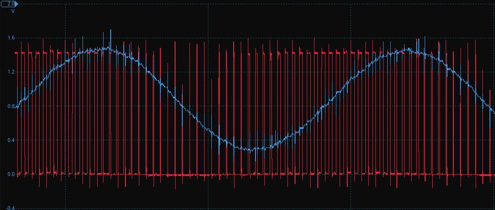

# ⚡ Oscilloscope & Signal Generator — DTU 30082 Project

Welcome to the **Oscilloscope_Project**, developed for the DTU course **30082 – Projektarbejde i Digitalteknik**.  
This full-stack embedded system connects a **Basys 2 FPGA** signal generator, an **ATmega2560 oscilloscope**, and a **LabVIEW GUI**.  
It visualizes analog signals in real time and allows waveform control through a robust UART/SPI interface.

📄 **[Project Report (PDF)](docs/Oscilloscope_Project_Rapport.pdf)**

---

## 📂 Project Structure

```
Oscilloscope_Project/
├── Microcontroller/           # PlatformIO-based ATmega2560 codebase
├── fpga/                      # VHDL projects for signal generation
├── docs/                      # Technical documentation and filter analysis
├── README.md
└── .gitignore
```

---

## 🎯 Project Goal

Design and implement a digital oscilloscope system that:
- Samples analog waveforms with an ATmega2560
- Sends sampled data to a LabVIEW GUI over UART
- Receives waveform control commands via UART (shape, freq, amp)
- Forwards these settings to an FPGA-based signal generator via SPI
- Generates analog output through PWM and active low-pass filtering

---

## 🧰 Technologies Used

| Platform       | Tech                     | Purpose                                |
|----------------|--------------------------|----------------------------------------|
| ATmega2560     | C / PlatformIO           | UART, ADC, SPI, Interrupts             |
| FPGA (Basys 2) | VHDL (Xilinx ISE 14.7)   | PWM waveform generation via SPI input |
| PC (Windows)   | LabVIEW 2014 + NI-VISA   | GUI and protocol management            |
| Docs           | KiCad / LTspice / Maple  | Active filter design + verification    |

---

## 📡 Communication Protocols

### UART (MCU ↔ LabVIEW)
- **Baudrate:** `115200`, 8N1
- **Packet Format:**
  ```
  [0x55, 0xAA] + Length (2B) + Type (1B) + Data + Checksum (2B)
  ```
- **Types:**
  - `0x01` — Generator BTN pressed (with SW value)
  - `0x02` — Oscilloscope settings (sample rate, record length)
  - `0x03` — Start Bode plot
  - `0x04` — Trigger SPI stress test

### SPI (MCU → FPGA)
- 4-byte command packets:
  ```
  [0x55][ADDR][DATA][CHKSUM]
  ADDR: 1 = Amplitude, 2 = Frequency, 3 = Shape
  CHKSUM: ADDR ^ 0x55 ^ DATA
  ```

---

## 🔬 Subsystems

### 🟨 Microcontroller (ATmega2560)
- **ADC:** Timer1-triggered, 8-bit resolution (0–3.3V range)
- **UART0:** Debug output
- **UART1:** LabVIEW interface with interrupt-driven RX
- **SPI Master:** Sends waveform configuration to FPGA
- **Double/triple buffer** system for uninterrupted sampling
- **Stress test logic:** Transmits 10,000+ SPI packets after reset

### 🟦 FPGA (Basys 2)
- **PWM Generator:** Look-up tables drive pulse width per shape
- **SPI Slave:** Bit-shift protocol with byte-level sync and XOR validation
- **Waveform Types:** Constant, Square, Sawtooth, Triangle
- **Low-pass filter:** External 2nd–4th order analog smoothing stage

### 🟥 LabVIEW GUI
- **Tabs:** Generator, Oscilloscope, Bode Plot
- **Live Display:** ADC waveform and waveform config feedback
- **User Input:** Shape, amplitude, frequency, sample rate, record length
- **Checksums:** Supports ZERO16, LRC8, CRC16-CCITT
- **Simulator:** Emulate communication without hardware

---

## 🔍 Filter Design

- Designed using **KiCad** and validated in **LTspice**
- Active filters reduce PWM ripple for sine/sawtooth fidelity
- Mathematical modeling and transfer function analysis via **Maple**

### 📈 Output vs Filtered Waveform

The following scope capture shows both the raw PWM signal (red) and the filtered analog output (blue), confirming the effectiveness of the low-pass filter design:



---

## ⚠️ Known Limitations

- ❌ **User cannot freely adjust sample rate**  
  Sample rate is internally derived based on selected record length for optimal performance and continuous sampling.  
  Manual control of the sample rate is not supported in the final version, though it was implemented in earlier iterations.
  
- ✅ **Triangle waveform added**  
  Not part of original spec, added as an extra signal type.

---

## ✅ Features Implemented

- [x] Timer-driven ADC sampling (up to 10,000 sps)
- [x] UART parser with sync header, length, type, and checksum
- [x] SPI communication with custom byte-protocol and integrity checks
- [x] Real-time waveform generation: Constant, Square, Sawtooth, Triangle
- [x] GUI feedback and control via LabVIEW
- [x] External analog filtering tuned to PWM frequency
- [x] SPI stress test system (10k packets + FPGA reset)
- [x] Robust double-buffer system for uninterrupted signal capture

---

## 👥 Authors

**Embedded C (MCU, UART, SPI, ADC):**  
- Mads Rudolph  
- Sigurd Hestbech Christiansen  

**FPGA Design (PWM, LUTs, SPI Slave):**  
- Jonas Jensen  
- Andreas Jacobsen  
- Joakim Butenko

> All members contributed to testing, integration, and review across subsystems.

---

## 🔐 License

This project was created for the **DTU 30082 course** and is released for **educational, non-commercial use only**.
